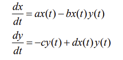
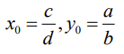
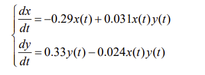
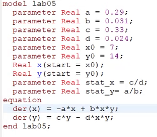
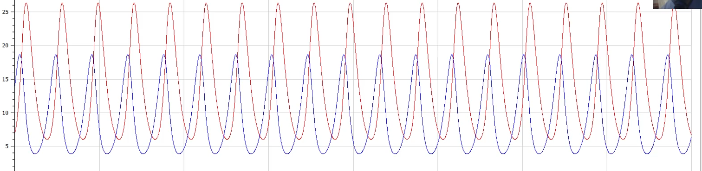
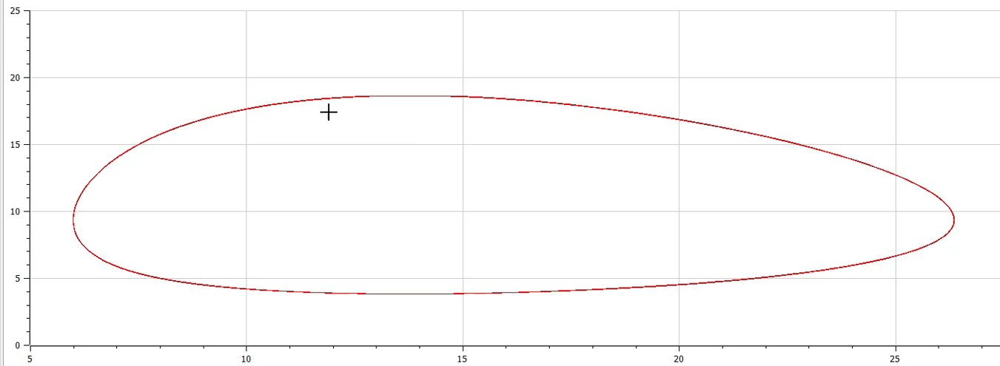

<h1 align="center">

РОССИЙСКИЙ УНИВЕРСИТЕТ ДРУЖБЫ НАРОДОВ 

Факультет физико-математических и естественных наук  

Кафедра прикладной информатики и теории вероятностей

ОТЧЕТ ПО ЛАБОРАТОРНОЙ РАБОТЕ №5
  
<h2 align="right">

дисциплина: Математическое моделирование

Преподователь: Кулябов Дмитрий Сергеевич

Студент: Поляков Арсений Андреевич

Группа: НФИбд-03-19
  
  
<h1 align="center">

МОСКВА

2022 г.
</h1>

# **Цель работы**

Построение модели Лотки-Вольтерры "хищник-жертва".

# **Теоретическое введение**

Данная двувидовая модель основывается на
следующих предположениях:
1. Численность популяции жертв x и хищников y зависят только от времени
(модель не учитывает пространственное распределение популяции на
занимаемой территории)
2. В отсутствии взаимодействия численность видов изменяется по модели
Мальтуса, при этом число жертв увеличивается, а число хищников падает
3. Естественная смертность жертвы и естественная рождаемость хищника
считаются несущественными
4. Эффект насыщения численности обеих популяций не учитывается
5. Скорость роста численности жертв уменьшается пропорционально
численности хищников

Уравнение имеет следующий вид:

В этой модели x – число жертв, y - число хищников. Коэффициент a описывает скорость естественного прироста числа жертв в отсутствие хищников, с- естественное вымирание хищников, лишенных пищи в виде жертв. Вероятность взаимодействия жертвы и хищника считается пропорциональной как количеству жертв, так и числу самих хищников (xy). Каждый акт взаимодействия уменьшает
популяцию жертв, но способствует увеличению популяции хищников (члены -bxy
и dxy в правой части уравнения).

Стационарное состояние системы уравнений (положение равновесия, не зависящее от времени решение) будет в точке:

 

# **Условия задачи**

_Вариант 35_

Для модели «хищник-жертва»:

Постройте график зависимости численности хищников от численности жертв,а также графики изменения численности хищников и численности жертв при следующих начальных условиях:

x0 = 7, y0 = 14 .

Найдите стационарное состояние системы. 
(интервал t = [0; 400] (шаг = 0.1)).

# **Выполнение лабораторной работы**

**_Построение модели Лотки-Вольтерры "хищник-жертва"_**

Модели «хищник-жертва» Варианта-35:

Чтобы построить фазовый портрет модели, я написал следующий код:

и получил фазовый портрет модели в варианте для обычной системы, зависящей от времени:

и фазовый портрет модели в варианте для параметрической системы:

# Выводы

После завершения данной лабораторной работы - я научился выполнять построение модели Лотки-Вольтерры "хищник-жертва" в OpenModelica.

# Список литературы

1. Кулябов, Д.С. - Модель хищник-жертва  
https://esystem.rudn.ru/pluginfile.php/1343893/mod_resource/content/2/Лабораторная%20работа%20№%204.pdf
